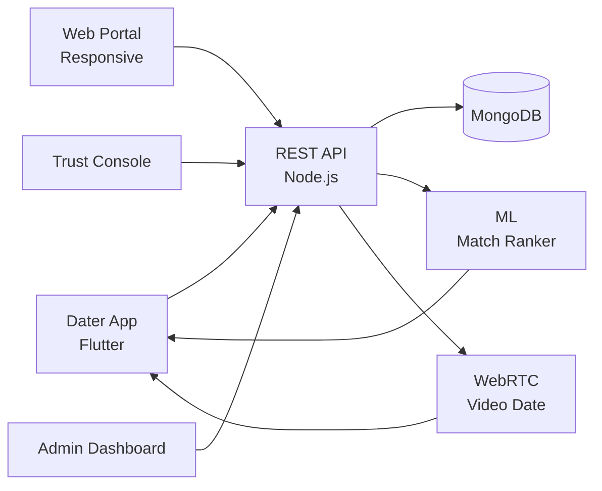

# Tinder Clone — White-Label Dating & Social Discovery Platform by Miracuves

**MXIngle** is a production-ready, white-label Tinder clone: a complete dating & social-discovery platform with profiles, swipes, chat, and admin console — delivered with **100% source code ownership** in **6 working days**.

> 💕 **See it running before you talk to anyone.** Live dater app, match console, and admin panel — demo credentials are printed on the [solution page](https://miracuves.com/tinder-clone#demo). No sales call required.

---

## 🚀 Live Demos

| Environment | URL | What you can test |
|---|---|---|
| 📱 Dater App | [mas.mimeld.com](https://mas.mimeld.com) | Browse, swipe, match, chat, video date |
| 🌐 Web Portal | [mxingle.mimeld.com](https://mxingle.mimeld.com) | Full dating experience in browser |
| 🛡️ Trust Console | [Solution page → Demo](https://miracuves.com/tinder-clone#demo) | Verifications, reports, takedowns |
| 🛠️ Admin Dashboard | [Solution page → Demo](https://miracuves.com/tinder-clone#demo) | Users, monetization, analytics |

Demo credentials for all environments: **[miracuves.com/tinder-clone → Demo section](https://miracuves.com/tinder-clone/#demo)**

---

## ✨ What Makes This Tinder Clone Different

Most dating scripts stop at "swipe + match." This platform ships with the features that actually run a dating *business*:

- **Smart Match Algorithm** — vector embeddings + behavioural features give better daily picks — what Hinge and Bumble charge up to $40/mo for
- **Video Date Built-In** — WebRTC 1-on-1 video dates with safety features (blur, hold-to-report) — what Bumble pioneered
- **Trust & Safety Stack** — photo/selfie/ID verification, AI moderation, user reports — production-grade from day one
- **Tiered Subscriptions** — free / plus / premium with boosts, see-who-likes-you, unlimited swipes — same LTV mechanics Tinder runs
- **AI Photo Scoring** — prompts for better photos, ranked by likelihood of right-swipes — what Hinge uses to drive upgrades

## 📦 Core Features

**Dater:** profile & photos · swipe deck · match list · chat · video date · share location · premium boosts · referrals

**Trust & Safety:** photo/selfie verification · background checks · user reports · AI moderation · takedown workflow · appeals

**Admin:** user management · monetization controls · A/B testing · pricing · analytics

## 🏗️ Architecture

**Stack:** Flutter mobile apps (Android + iOS) · Node.js backend · MongoDB · Redis for match queue · WebRTC for video · Stripe for subscriptions · Stripe, Apple/Google in-app purchases (IAP), regional gateways

## 📋 What’s Included

- ✅ Full source code — backend, web, mobile apps, panels (no encryption, no license locks)
- ✅ Deployment to your servers & app store submission assistance
- ✅ Your branding — white-label rename, logo, colors, domain
- ✅ 60 days post-launch support + 12 months of free updates
- ✅ Documentation & handover

**Pricing:** from **$4,899**, transparent on the [solution page](https://miracuves.com/tinder-clone/#pricing) — no "contact us for quote" games.

## 🆚 Why Not Build From Scratch?

Custom dating platforms run $80k–$350k and 5–10 months. A proven white-label base gets you to market in 6 working days for a fraction of that, with your budget preserved for growth marketing and trust & safety ops.

## 📚 Resources

- 📖 [Tinder Clone — Full Solution Page](https://miracuves.com/tinder-clone) (features, pricing, demos, FAQ)
- 💰 [How Much Does a Dating App Cost in 2026?](https://miracuves.com/tinder-clone#pricing) pricing breakdown & what's included
- 📝 [Best Tinder Clone Script in 2026](https://miracuves.com/tinder-clone/blog/) features, pricing & launch guide
- 🧠 [Trust & Safety: The Decisive Moat in Dating Apps](https://miracuves.com/tinder-clone/blog/) verification, moderation, brand
- ✅ [Miracuves Facts & Claims Ledger](https://miracuves.com/tinder-clone/facts/) every claim we make, verified

## 🏢 About Miracuves

[Miracuves Solutions](https://miracuves.com) builds white-label clone apps and custom software from Mumbai, India — 90+ ready-made solutions, live demos for every product, transparent pricing, and delivery in 6 working days. Operating since 2010.

**Talk to us:** [WhatsApp](https://wa.me/919830009649) · [Schedule a consultation](https://miracuves.com/schedule-consultation/) · [miracuves.com](https://miracuves.com)

---

### ⚠️ Note on This Repository

This repository is a product overview. The full source code is delivered to clients on purchase — see [what’s included](https://miracuves.com/tinder-clone/#included). For a hands-on evaluation, use the live demos above; credentials are public on the solution page.

*Keywords: tinder clone, tinder clone script, dating app, match platform, white label Tinder, video date, Flutter dating app, Node.js dating*

---

<!--
══════════════════════════════════════════════════
TEMPLATE VARIABLE KEY — auto-generated from Netflix-Clone pattern
══════════════════════════════════════════════════
{APP_NAME}        Tinder Clone
{MX_NAME}         MXIngle
{CATEGORY}        Dating & Social Discovery Platform
{DEMO_WEB}        mxingle.mimeld.com
{PRICE}           $4,899
{SLUG}            tinder-clone
{SOLUTION_URL}    https://miracuves.com/tinder-clone/
{VERTICAL}        dating

See /tmp/verticals/dating.txt for the vertical config used to generate this README.
══════════════════════════════════════════════════
-->